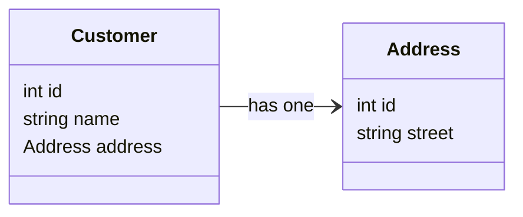
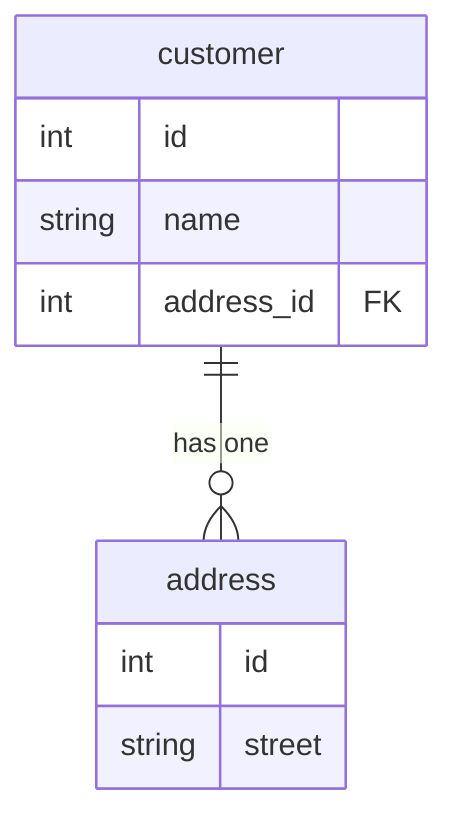
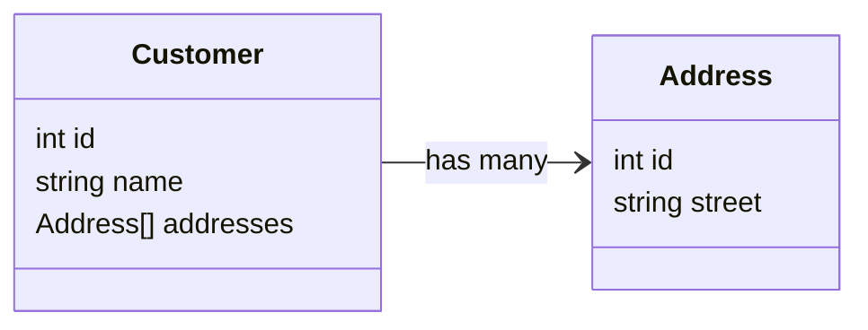
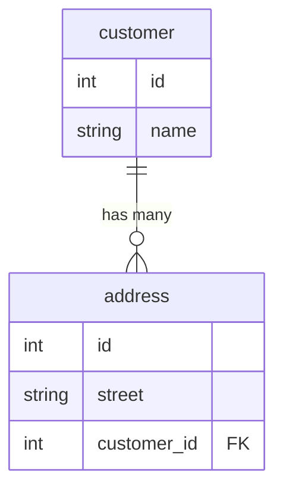
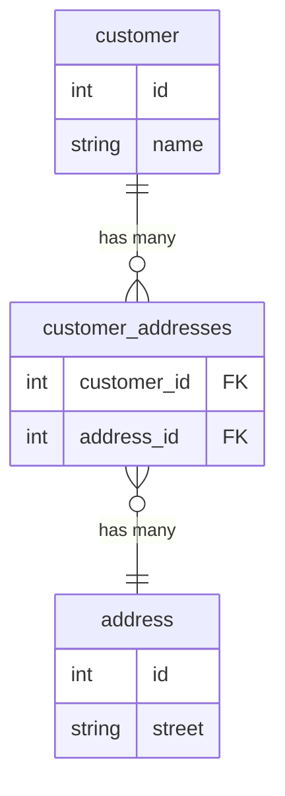

In this guide, we will explore how Herbs2Knex handles relationships between entities while bridging the gap between domain modeling and relational database modeling.

## Introduction

Before we begin, it is essential to understand a few concepts.

**Domain Modeling vs Relational Database Modeling**

It is essential to recognize that domain modeling differs from relational database modeling. As a developer, being aware of these differences will help you understand the architectural decisions behind Herbs2Knex. A crucial aspect to keep in mind is the [Object-relational impedance mismatch](https://en.wikipedia.org/wiki/Object%E2%80%93relational_impedance_mismatch). This concept refers to the challenges of mapping between objects and relational databases.

Herbs is a Domain-first Development framework, which means that every example begins with domain entities and unfolds into a database representation. 

**Architectural Decisions**

In order to solve the gap between domain modeling and relational database modeling, Herbs2Knex makes a few architectural decisions, trying different approaches to find the best balance between simplicity and flexibility.

- **Simple Abstraction**: Herbs2Knex tries to find a balance between simplicity and transparency. It will not try to hide completely the mapping process. It is important that the developer is aware of what is happening and be able to debug and troubleshoot.

- **Metadata**: Herbs2Knex uses metadata to describe the mapping process. This metadata is used to dynamically generate the repository class.

With these concepts in mind, let's explore how Herbs2Knex handles relationships between entities.

## Entity Association

### One-to-One

In a one-to-one relationship, an entity (A) has a uni-directional reference to a single entity (B).

For example, a `Customer` has a single `Address`:
<div style={{textAlign: 'center'}}>


</div>

<details>
<summary>Entities</summary>

```js
const Address = entity('Address', {
    id: id(Number),
    street: field(String),
    ...
})

const Customer = entity('Customer', {
    id: id(Number),
    name: field(String),
    address: field(Address)
})
```
</details>

In order to map this relationship to the database, the `Customer` table will have a foreign key to the `Address` table.

<div style={{textAlign: 'center'}}>


</div>

<details>
<summary>Database</summary>

```sql
CREATE TABLE address (
    id SERIAL PRIMARY KEY,
    street VARCHAR(255) NOT NULL,
    ...
);

CREATE TABLE customers (
    id SERIAL PRIMARY KEY,
    name VARCHAR(255) NOT NULL,
    address_id INTEGER REFERENCES address(id)
);
```

</details>

With the entities and the database tables modeled, it is necessary to define the mapping between the `Customer` and `Address` entities in the repository.

```js
const { Customer } = require('../domain/entities/customer')

class CustomerRepository extends Repository {
    constructor() {
        super({
            entity: Customer,
            table: 'customers',
            fields: {
                address: { 
                    associate: { id: 'address_id' }, // (field) Address.id -> (column) customers.address_id
                },
            },
            knex: connection
        })
    }
}
```

<details>
<summary>Usage</summary>

**Find, FindByID, FindAll**

```js
const repo = new CustomerRepository()

const customer = await repo.findByID(1234)

console.log(customer) // Customer { id: 1234, name: 'John Doe', address: Address { id: 5678 } }
```

**Insert**

```js
const addressRepo = new AddressRepository()
const newAddress = Address.fromJSON({ street: '123 Main St' })
const address = await addressRepo.insert(newAddress) 
// Address { id: 5678, street: '123 Main St' }

const customerRepo = new CustomerRepository()
const newCustomer = Customer.fromJSON({ name: 'John Doe', address })
const customer = await customerRepo.insert(newCustomer) 
// Customer { id: 1234, name: 'John Doe', address: Address { id: 5678 } }
```


**Update**

```js
const repo = new CustomerRepository()
const customer = await repo.findByID(1234)
customer.name = 'Jane Doe'
customer.address.id = 9999 // this will update the foreign key address_id
customer.address.street = '456 Main St' // this will be ignored
await repo.update(customer)
```

Any changes to Address other than the ID will be ignored. Foreign keys constraints will be enforced by the database.

**Delete**

```js
const repo = new CustomerRepository()
const customer = await repo.findByID(1234)
await repo.delete(customer)
```

It will not affect the `Address` table.

</details>

### One-to-Many

In a one-to-many relationship, an entity (A) has a uni-directional reference to a collection of entities (B).

For example, a `Customer` has many `Address`:

<div style={{textAlign: 'center'}}>


</div>

<details>
<summary>Entities</summary>

```js
const Address = entity('Address', {
    id: id(Number),
    street: field(String),
    ...
})

const Customer = entity('Customer', {
    id: id(Number),
    name: field(String),
    addresses: field([Address])
})
```
</details>

In order to map this relationship to the database, the `Address` table will have a foreign key to the `Customer` table.

<div style={{textAlign: 'center'}}>


</div>

<details>
<summary>Database</summary>

```sql
CREATE TABLE customers (
    id SERIAL PRIMARY KEY,
    name VARCHAR(255) NOT NULL
);

CREATE TABLE address (
    id SERIAL PRIMARY KEY,
    street VARCHAR(255) NOT NULL,
    customer_id INTEGER REFERENCES customers(id)
);
```

</details>

With the entities and the database tables modeled, it is necessary to define the mapping between the `Customer` and `Address` entities in the repository.

```js
const { Customer } = require('../domain/entities/customer')
const { Address } = require('../domain/entities/address')

class CustomerRepository extends Repository {
    constructor() {
        super({
            entity: Customer,
            table: 'customers',
            fields: {
                addresses: {
                    fetch({ id }) {
                        return new AddressRepository().find({ customer_id: id })
                    },
                },
            },
            knex: connection
        })
    }
}

class AddressRepository extends Repository {
    constructor() {
        super({
            entity: Address,
            table: 'address',
            fields: {
                customer: {
                    associate: { id: 'customer_id' }, // (field) Customer.id -> (column) address.customer_id
                },
            },
            knex: connection
        })
    }
}
```

<details>
<summary>Usage</summary>

**Find, FindByID, FindAll**

```js
const repo = new CustomerRepository()

const customer = await repo.findByID(1234)

console.log(customer) // Customer { id: 1234, name: 'John Doe', addresses: [ Address { id: 5678, street: '123 Main St' }, Address { id: 9012, street: '456 Main St' } ] }
```

**Insert**

Even though the `customer` field is not defined in the `Address` entity, it is defined in the `AddressRepository` and will be used to insert the foreign key.

```js
const customerRepo = new CustomerRepository()
const newCustomer = Customer.fromJSON({ name: 'John Doe' })
const customer = await customerRepo.insert(newCustomer)
// Customer { id: 1234, name: 'John Doe' }

const addressRepo = new AddressRepository()
const newAddress1 = Address.fromJSON({ street: '123 Main St', customer })
const address1 = await addressRepo.insert(newAddress1)

const newAddress2 = Address.fromJSON({ street: '456 Main St', customer })
const address2 = await addressRepo.insert(newAddress2)
```

**Update**

Since the foreign key is defined on the `address` table, it is necessary to use the `AddressRepository` to update the `customer` field.

```js
const repo = new AddressRepository()
const address = await repo.findByID(5678)
address.customer.id = 1234 // this will update the foreign key customer_id
address.customer.name = 'Jane Doe' // this will be ignored
await repo.update(address)
```

Any changes to Customer other than the ID will be ignored. Foreign keys constraints will be enforced by the database.

**Delete**

```js
const repo = new AddressRepository()
const address = await repo.findByID(5678)
await repo.delete(address)
```

</details>

### One-to-Many Through

In a one-to-many through relationship, it is similar to a one-to-many relationship, but the relationship is defined through a third table.

For example, a `Customer` has many `Address`:

<div style={{textAlign: 'center'}}>


</div>

<details>
<summary>Entities</summary>

```js
const Address = entity('Address', {
    id: field(Number),
    street: field(String),
    ...
})

const Customer = entity('Customer', {
    id: field(Number),
    name: field(String),
    addresses: field([Address])
})
```
</details>

From a domain perspective, the relationship appears similar to a one-to-many association. However, examining it from the database perspective reveals a different relationship. In this case, a single `Customer` can be associated with multiple `Address`es, and concurrently, one `Address` can be associated with numerous `Customer`s.

<div style={{textAlign: 'center'}}>


</div>

To map this relationship to the database, we need a third table, `customer_addresses`, which will have a foreign key to both the `customer` and `address` tables.

<details>
<summary>Database</summary>

```sql
CREATE TABLE customers (
    id SERIAL PRIMARY KEY,
    name VARCHAR(255) NOT NULL,
    ...
);

CREATE TABLE address (
    id SERIAL PRIMARY KEY,
    street VARCHAR(255) NOT NULL,
    ...
);

CREATE TABLE customer_addresses (
    customer_id INTEGER REFERENCES customers(id),
    address_id INTEGER REFERENCES address(id),
    PRIMARY KEY (customer_id, address_id)
);
```
</details>

To define the relationship in the repository, it is necessary to define the mapping between the `Customer` and `Address` entities.

```js
const { Customer } = require('../domain/entities/customer')
const { Address } = require('../domain/entities/address')

class CustomerRepository extends Repository {
    constructor() {
        super({
            entity: Customer,
            table: 'customers',
            fields: {
                addresses: {
                    associate: { id: 'address_id' }, // (field) Address.id -> (column) customer_addresses.address_id
                    through: 'customer_addresses',
                },
            },
            knex: connection
        })
    }
}

class AddressRepository extends Repository {
    constructor() {
        super({
            entity: Address,
            table: 'address',
            fields: {
                customers: {
                    associate: { id: 'customer_id' }, // (field) Customer.id -> (column) customer_addresses.customer_id
                    through: 'customer_addresses',
                },
            },
            knex: connection
        })
    }
}
```

TO DO

<details>
<summary>Usage</summary>

**Find, FindByID, FindAll**

```js

```
</details>

### Many-to-Many

Conceptually, a many-to-many relationship is possible when an entity (A) has a collection of entities (B), and those entities (B) also have a collection of entities (A).

However, in practice, [circular dependencies](https://nodejs.org/api/modules.html#cycles) is very tricky to handle in Node.js and it is not recommended.

<details>
<summary>Example</summary>

`customer.js`
```js
const Address = require('./address')

const Customer = entity('Customer', {
    id: field(Number),
    name: field(String),
    addresses: field([Address])
})
```

`address.js`
```js
const Customer = require('./customer') // circular dependency

const Address = entity('Address', {
    id: field(Number),
    street: field(String),
    customers: field([Customer])
})
```

</details>

Because of this, Herbs2Knex does not support many-to-many relationships directly. An alternative is to use a one-to-many through relationship.