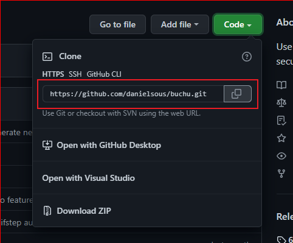

Glad you are here! Pull requests, or feature requests, though not always implemented, are a great way to help make Herbs even better than it is now. If you're looking for something specific to help out with, there's a number of unit tests that aren't implemented yet, the library could never have too many of those. 

Considering that the ecosystem of Herbs has numerous libraries, each one has its own specificity that you will find in this documentation in a more detailed way. 
However, if you want to submit a fix or feature, take a look at the [CONTRIBUTING](https://github.com/herbsjs/herbs/blob/main/.github/CONTRIBUTING.md) readme in the Github and go ahead and open a ticket.

## Getting started
All work on Herbs happens directly on GitHub. Both core team members and external contributors send pull requests which go through the same review process.


By default **Herbs organization** uses [Angular Commit Message Conventions](https://github.com/angular/angular/blob/master/CONTRIBUTING.md#-commit-message-format).

Tools such as [commitizen](https://github.com/commitizen/cz-cli) or [commitlint](https://github.com/conventional-changelog/commitlint) can be used to help contributors and enforce valid commit messages.

## Requirements

- Account created on [Github](https://github.com/signup)
- Application for development or of your own. Example [VsCode](https://code.visualstudio.com/download)
- [NodeJS](https://nodejs.org/en/download/package-manager/)
- [Git](https://github.com/git-guides/install-git)

## Contributing flow
 

## Issues
First step to be done is access the project you want to contribute to and take a look at the issue tab, maybe there is already an issue open you want to work on, or you can even open one to be discussed.

**Labels** are automatically defined when the issue/PR is opened and are updated if needed by core members.

Both **issues** and **PR** have labels to identify them, in order to identify the type, criticality and whether it is already under development. Below are some examples:

`documentation` -> Improvements or additions to documentation.

`enhancement` -> New feature or request.

`ready-to-work` -> Item is ready to work on it.

`wip` -> Working In Progress.

`bug` -> Something isn't working.

To know other tags and their reasons, access the link below:

[Herbs Labels](https://github.com/herbsjs/herbs/labels)

We will use the [buchu](https://github.com/herbsjs/buchu) project as an example.

1. Go to the Herbs home page on Github and access the buchu project.
```sh
https://github.com/herbsjs
```
2. Click on the Issues tab

Just choose which issue you want to act on and comment that you will act so other members are aware and your effort is not wasted.
You will have access to all open issues and also those that have already been closed.

Below we have some links to make your search easier if you want to know all the open PRs without anyone acting or want to give tips or even help someone in an issue that is under development.

[Open issues ready to work and without an owner yet](https://github.com/search?o=desc&q=org%3Aherbsjs+label%3Aready-to-work+-label%3Awip+state%3Aopen&s=created&type=Issues)

[Open issues with work in progress](https://github.com/search?q=org%3Aherbsjs+-label%3Aready-to-work+label%3Awip+state%3Aopen&type=Issues)

[Open issued with help wanted or extra attention needed](https://github.com/search?o=desc&q=org%3Aherbsjs+label%3A%22help+wanted%22+state%3Aopen&s=created&type=Issues)

## Fork
After we know which issue we are going to attack, we now need to fork the repository.

Very simple, just click on the Fork button that is on the upper right, next to your photo.
That way you'll have something from our repository in your own repository area, and that's where you'll act.

## Clone
After Fork, you will automatically be inside the cloned repository, if not, just click on your photo and go to your repositories. There you will be able to locate the cloned repository.

Now we need to download it to your development environment so you can code.

1. Access the cloned repository, in our example it is buchu.

2. Now just click on the green button called Code.

3. Some download forms like .zip will be displayed, but in our case we will use HTTPS.



4. Copy the HTTPS being displayed and open a terminal of your choice.

5. With the terminal open, access a folder where you want to save the project using the command below and replace "Your Folder" with the desired folder.
```sh
cd <Your Folder>
```

6. You will now type the command below and replace "Your Link" with the one copied on Github.
```sh
git clone <Your Link>
```
Press enter and the repository download process will begin.

## Commit
After the development of the task, we will do the commit process.

We use some patterns as said before, and to help keep everything organized we will be using commitizen, which is already implemented in all libraries.

1. We will install commitizen globally in your environment.
```sh
npm install -g commitizen
```

2. Now we will add all the files that you have modified or can specify them.

`All files`
```sh
git add .
```
`Specific file, example file called usecase.js`
```sh
git add usecase.js
```

3. Now is the time for us to write a summary of what we've worked on. We will use the command below to initiate the commit message.

```sh
npm run commit
```

We will follow the pattern that would inform the type, scope and a short message of what we did in the developed code.

4. And to finish we will send all commits to our Github with the command below.

```sh
git push
```

## Pull Request

And the most awaited moment has arrived, the time to make our first pull request.

We will access our repository on Github. Not the buchu from the Herbs organization, but the one we downloaded using git clone, which is in our repository list.

1. After accessing our repository, we will go to the **Pull Requests** tab

2. We will click on the **New pull request** button.

3. At this moment the **Buchu** repository and the **master** branch are being displayed, and on the right side will be **our repository and our branch** that has the new changes.

4. Below will be displayed all the modified files, being all right we will click on the **create pull request** button

5. At that moment a form will be displayed in which you must fill in the information regarding your **PR**. And fill in a **title** if it is blank.

6. Finally, we will confirm the creation of the PR by clicking on the **create pull request** button

At that moment your PR will be created and it will go through the checks in the workflow, everything being ok, wait for your PR to be reviewed and merged.

## No-code Contributions
Contributions to Herbs are not limited to GitHub. You can help others by sharing your experience using Herbs, whether that is through blog posts, presenting talks at conferences, or simply sharing your thoughts on Twitter and tagging @herbsjs. We also have a server in [Discord](https://discord.com/invite/e3cQ66KDv5) to focus our doubts and chat!

## Why do you want to contribute to open source?
We have several reasons to contribute to open source projects but we can summarize the main and most important ones.
## Build your confidence as a developer:
  - If you're just starting your career or learning a new programming language, open-source projects are the best way to get started. In it you will receive immediate feedback on your development skills, suggestions for improvements regarding the declaration and name of variables/functions and different views on how to improve or apply condicional logic that can be identified in your code.
## Build your resume or gain experience in new challenges:
  - Even if you're an experienced developer, you might want to build a stronger resume to help with your career development or future job searches. Perhaps you are interested in exploring a new cutting-edge framework or a new programming module and don't have opportunities to do either at work.
## Build your professional network:
  - Building a strong professional network can help you achieve your career goals, learn more about your own fields or adjacent fields, and help with your job search.

Open source empowers you to build your confidence as a developer, build your resume, and build your professional network. Moreover, your contribution—no matter how big or small—makes a direct impact on the future of the open source project. 

## Resources

- [How to Contribute to Open Source](https://opensource.guide/how-to-contribute/)
- [How to Contribute to an Open Source Project on GitHub (Free Video)](https://app.egghead.io/playlists/how-to-contribute-to-an-open-source-project-on-github)
- [Using Pull Requests](https://help.github.com/articles/about-pull-requests/)
- [GitHub Help](https://help.github.com)
