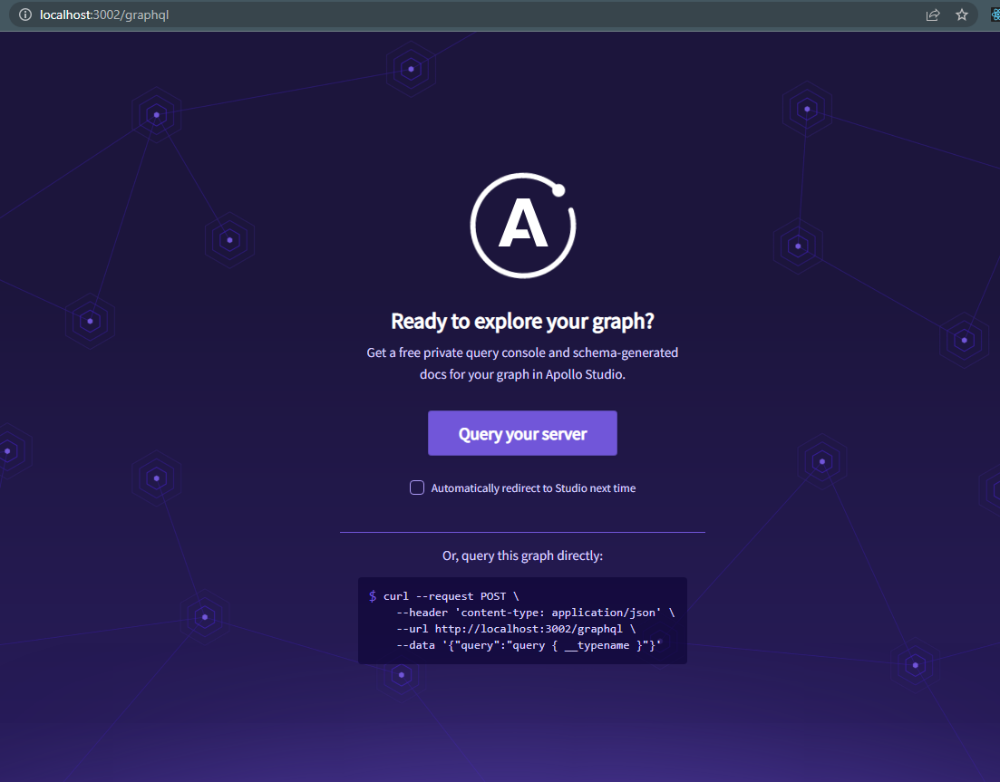
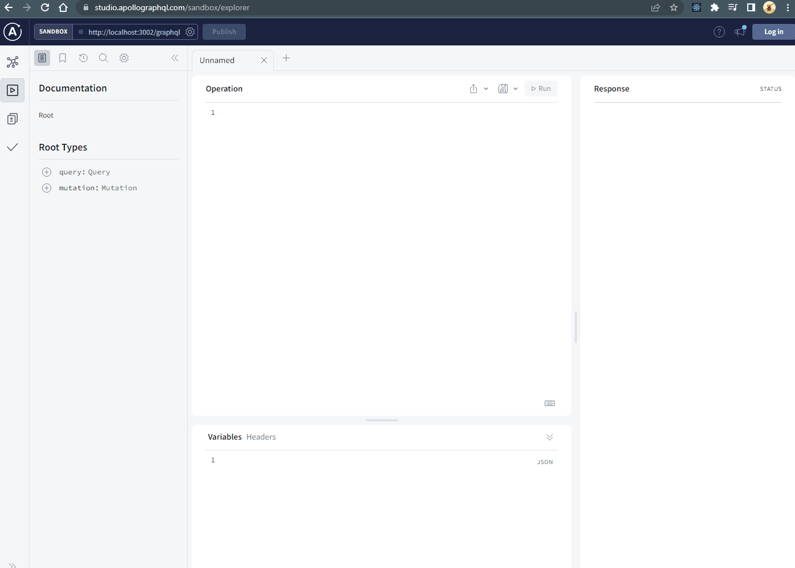
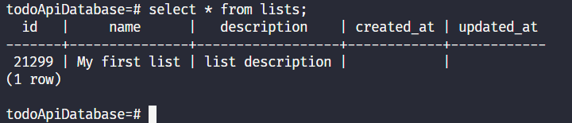
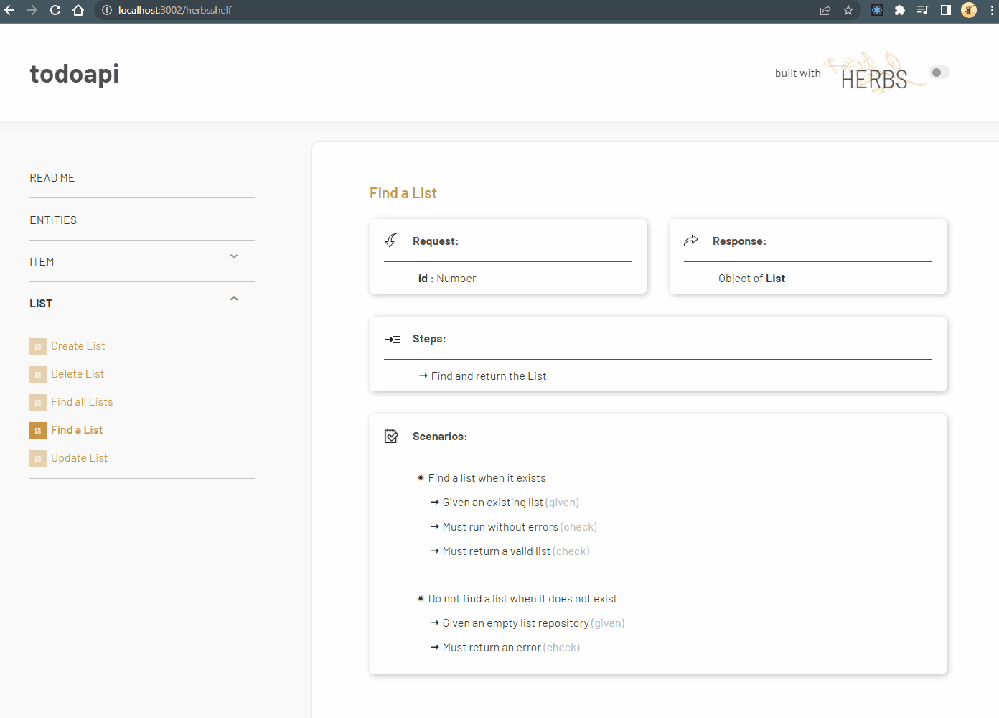
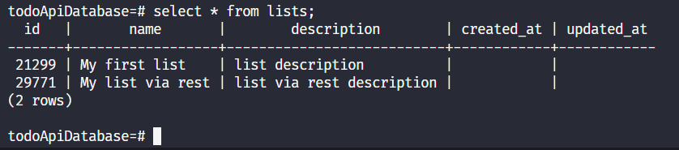

Herbs supports in REST **and** GraphQL APIs, which means that you can provide two options for the client's request using the same use case!

The `herbs`, through the metadata that the `herbarium` stores, prepares all the mutation typing and queries for the graphql layer of the api, as well as all the routes that will be used, so now we just need to run our project and make the requests.

It is not the intention of this tutorial to explain Graphql and Rest, we believe you already have some familiarity with these terms.

> GraphQL is a query language for your API, and a server-side runtime for executing queries using a type system you define for your data.
>
> — [*Introduction to GraphQL | GraphQL*](https://graphql.org/learn)

## Running

Let's start running follow commando to start application:

```bash
npm run start
```

You will get a result in the terminal that looks like this:


In the message we can see the Rest endpoints that were generated, following the graphql access route, a `herbsshelf` access route and finally the api main route and its port.

## /graphql 

Now it is time to access the graphql playground and start creating lists and items.

Access the route `/graphql`, and you see a follow screen:



Click on 'Query your server' and the next screen we will be able to start
requests.

In this panel that we see in the picture below,
we build a Mutation to create a new list.


Now we can check on database in table list that our new list are created:



below are the mutation and variables used in this example

**Graphql Mutation**
```graphql
mutation CreateNewList($name: String, $description: String) {
  createList(name: $name, description: $description) {
    id
    name
    description
  }
}
```
**Variables**
```json
{
  "name": "My first list",
  "description": "list description"
}
```


## /herbsshelf

Herbs Shelf is a self-generated documentation based on [use cases](/docs/usecase/getting-started) and [entities](/docs/entity/getting-started) from your domain. 

Access this route in your web browser and know this powerfull and beautiful
doc that `herbs` brings to you:



> Refer [**Herbs Shelf**](/docs/glues/herbsshelf) to know more.

## Requesting via Rest

To close this tutorial, let's make the same request to save a list, only this time through the Rest layer of our application, using [insomnia](https://insomnia.rest/) to make this request.


And again, we can check on database in table lists, our records made:


## The last step

Thank you very much and congratulations for getting here, herbs is a tool built with a lot of dedication and that is in constant evolution, we hope you can enjoy what herbs has to offer.

Join our community and help us improve herbs even more.

- [Discord](https://discord.gg/e3cQ66KDv5)
- [Twitter](https://twitter.com/herbsjs)