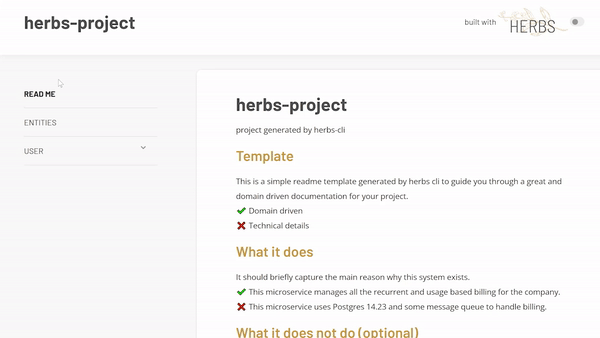

## Introduction to Herbs Shelf

> Herbs Shelf is a self-generated documentation based on your use cases and entities from your domain.
>
> — [Herbs Shelf | HerbsJS](/docs/glues/herbsshelf)



## Herbs Shelf Setup

To setup the automatic documentation, we need a list with all use cases to be included in the documentation. With CLI, it is in `src/domain/usecases/index.js`:

```js
// src/domain/usecases/index.js
module.exports = [
    // the tags are to store metadata, such as the group and type of the use case
    { usecase: require('./user/createUser'), tags: { group: 'Users', type: 'mutation'} },
    { usecase: require('./user/updateUser'), tags: { group: 'Users', type: 'mutation'} },
    { usecase: require('./user/deleteUser'), tags: { group: 'Users', type: 'mutation'} },
    { usecase: require('./user/findOneUser'), tags: { group: 'Users', type: 'query'} }
]
```

Once you have this file, you can use it with `@herbsjs/herbsshelf` to get the HTML content and do what you want with it.

In this case, a route called `/herbsshelf` is set in the server to provide this:

```js
// src/infra/api/rest/index.js
const renderShelfHTML = require('@herbsjs/herbsshelf')

// Get that use cases list.
const usecases = require('../../../domain/usecases')

// Set up the route to serve the rendered HTML
app.get('/herbsshelf', (req, res) => {
    res.setHeader('Content-Type', 'text/html')

    const content = renderShelfHTML(usecases)
    res.write(content)
    res.end()
})
```

> Learn more about [Herbs Shelf](/docs/glues/herbsshelf).
