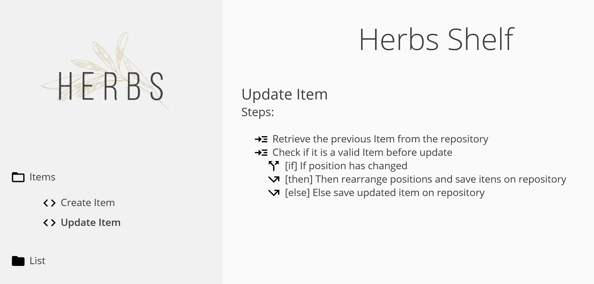

> Herbs Shelf is a self-generated documentation based on your use cases and entities from your domain.
>
> — [Herbs Shelf | HerbsJS](/docs/glues/herbsshelf)



## Herbs Shelf Setup

To setup the automatic documentation, you need a function which get an `injection` object and returns a list of usecases to be included in the documentation.

The convention is to implement this function with a file called `_uclist.js` in the usecases directory (`/src/domain/usecases`), as following:

```js
// src/domain/usecases/_uclist.js
module.exports = (injection) => {
    return [
        {
            // the usecase with the injection
            usecase: require('./createItem').createItem(injection),
            // the tags to store metadata, such as the group
            tags: { group: 'Items' }
        },
        {
            usecase: require('./getItem').getLists(injection),
            tags: { group: 'Item' }
        },
        {
            usecase: require('./createList').createList(injection),
            tags: { group: 'List' }
        },
        {
            usecase: require('./getList').getLists(injection),
            tags: { group: 'List' }
        },
    ]
}
```

Once you have this file, you can use it with `@herbsjs/herbsshelf` to get the HTML content and do what you want with.

In this case, we are going to set a route called `/docs` in the server to provide this:

```js
// src/infra/api/server.js
const renderShelfHTML = require('@herbsjs/herbsshelf')

// Get that function to return the
// usecases list.
const usecases = require('../../domain/usecases/_uclist')

// Set up the route to serve the rendered HTML
app.get('/docs', (req, res) => {
    res.setHeader('Content-Type', 'text/html')

    const content = renderShelfHTML(usecases())
    res.write(content)
    res.end()
})
```

> Know more about [Herbs Shelf](/docs/glues/herbsshelf).
