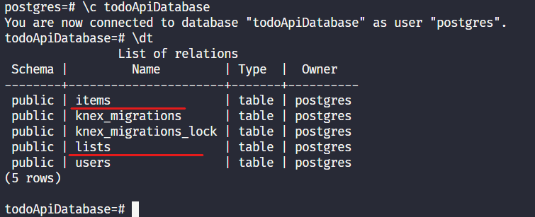

## Migrations in Herbs

Migrations, or rather database migrations, is a strategy for managing the changes that occur in an application's database throughout its life cycle. 

We won't go into the details of this approach here, just present that within `herbs` you can use all the features that knex.js provides for dealing with database migrations.

> Refer to [Knex.js Migrations Guide](http://knexjs.org/guide/migrations.html) to know more.

A few steps back, a few times we execute the `herbs update` command, and as we can see, `herbs-cli` has created several files in our project based on our entities, the use cases, specs and repositories.

The migrations files are part of this set and you can see them in:

```sh
src
└── infra
    └── data
        └── database
            └── migrations
                ├── 20220710004557_lists.js
                └── 20220710005004_items.js
```

Inside these files you will find the definitions that have created new or modified tables in the database. 

As an example, let's look at the schema that creates our list table and we can see that the same fields that we initially put in our List entity are being defined.

```javascript
exports.up = async function (knex) {
    knex.schema.hasTable('lists')
        .then(function (exists) {
            if (exists) return
            return knex.schema
                .createTable('lists', function (table) {
                    table.integer('id').primary()
                    table.string('name')
                    table.string('description')
                    table.timestamps()
                })
        })
}

exports.down = function (knex) {
    return knex.schema
    .dropTableIfExists('lists')
}

```

### Setting up a database

Now we are a few steps away from running our application and consuming its endpoints, but first we need to set up the connection to a database so that our data is saved and the application does its expected job.

For this tutorial we have chosen to use postgres as the database, but with herbs we can choose between `postgres`, `mysql`, `sqlserver` or `mongo`. so the setup is slightly different for each one of them and in the next step will be exclusively for you to see how to set up other databases.

### Set up with PostgreSQL

The configuration file is `src/infra/config/postgres.js`. It looks like this:

```js
// src/infra/config/postgres.js
const env = require('sugar-env')
require('dotenv').config()

module.exports = {
  client: 'pg',
  connection: {
    host: '127.0.0.1',
    user: 'postgres',
    password: 'postgres',
    database: 'todoApiDatabase'
  }
}
```

####  KnexFile
Projects thats uses Postgres, MySQL or SQLServer use [Knex.js](http://knexjs.org/) under the hood, so in these settings we'll have a `knexFile.js` in root of project. Make sure your database access credentials are matched in the `knexFile.js` and in the appropriate configuration file founded in `src/infra/config/...`.

The file `knexFile.js` it will should be like this:
```js
module.exports = {
    development: {
            client: 'postgresql',
            connection: {
            database: 'todoApiDatabase',
            user: 'postgres',
            password: 'postgres',
            host: '127.0.0.1',
            port: 5432
        },
        migrations: {
            directory: './src/infra/data/database/migrations',
            tableName: 'knex_migrations'
        }
    },
    staging: {},
    production: {}
}
```

### Running migrations

Now that we have set up the database connection and have a postgres instance running, let's run the command which will create our tables in the database.

run in your terminal:
```cmd 
npm run knex:migrate
```

when the execution finishes, we can access the postgres terminal and verify that in our database the tables have been created:




### Next step

Now we have everything we need to run our application and start making requests, we will see in the next step how to run our application and make requests to the endpoints that herbs delivers to us through the Graphql and Rest layers 