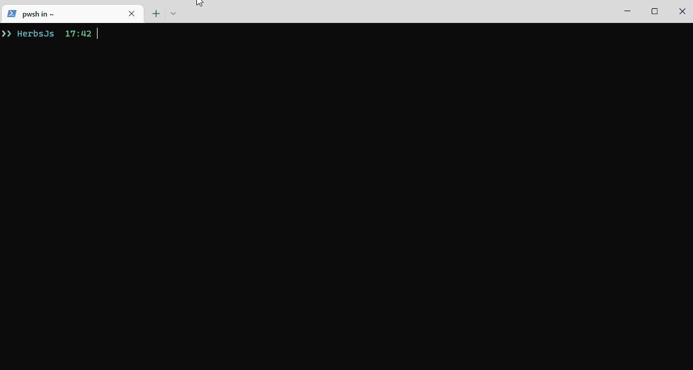

## Project Setup

We will use herbs-cli. We strongly recommend you use that, but you can set it manually if you prefer. 

Visit our [`herbs-cli`](https://github.com/herbsjs/herbs-cli) repository to find out more.

### With herbs-cli

1. Install [`herbs-cli`](https://github.com/herbsjs/herbs-cli) globally:

```sh
npm i -g @herbsjs/herbs-cli 
```

2. Create a new project using it:

```sh
herbs new
```

3. Answer the questions to create the project:

```javascript
// Type a name for your project.
? Project name? 

// Type a description to make it  \n easier to understand what the project is about.
? Project description? 

//  Set name o author's
? Project author name? 

// choose the license type that best suits your project
// you can choose between MIT, BSD and GNU
? What license do you want to use? 

// Confirm with (Y/n) to create a layer to graphql api
? Generate graphql layer? 

// Confirm with (Y/n) to create a layer to rest api
? Generate rest layer? 

// Choose a database between Postgres, Mongo, SQLServer, MySQL
? What database do you want to use? 

// Confirm with (y/N) to init a git repository
? Do you want to initialize a Git respository? 
```

Before theses questions, herbs-cli asks you want it run automatically 
some steps to install dependencies and start a server, feel free to choose better option, 
but we need config a database connection before start server, so will do this in next steps.
for now choose ```No, let me handle this```


See steps that will reproduced:




To finish this step, run ```cd todo-api``` to access project folder
and ```npm install``` to install project dependencies.


#### Initial Folder Structure

The initial folder structure generated by the CLI with ```herbs new``` command is as follows:

```sh
├── node_modules
├── package-lock.json
├── package.json
├── knexFile.js
└── src
    ├── index.js
    ├── domain
    │   ├── entities
    │   │   └── user.js
    │   └── herbarium.js 
    └── infra
        ├── api
        │   ├── graphql
        │   │   ├── index.js
        │   │   ├── queries.js
        │   │   ├── mutations.js
        │   │   └── types.js
        │   └── server.js      
        ├── config
        │   ├── api.js
        │   ├── index.js
        │   └── postgres.js
        ├── data
        │   └── database
        │       └── connection.js
        └── index.js
        
```

### Manually

You can also set up the file by your own. To help you on that, we have an [extension for VS Code](https://marketplace.visualstudio.com/items?itemName=EndersonCosta.herbs-snippets) with code snippets and templates.
